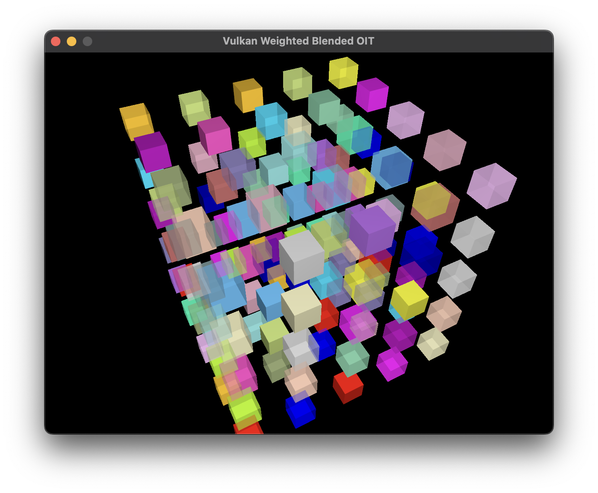
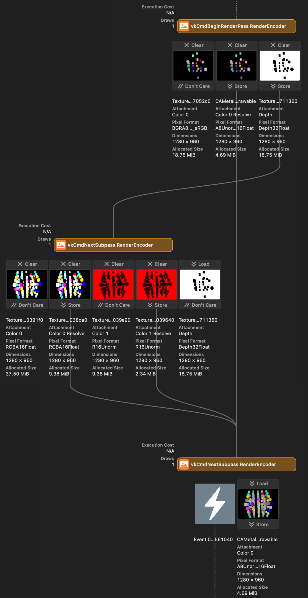

# vk-weighted-blended




Rendering both opaque and translucent objects using Weighted Blended OIT in Vulkan. In screenshot, there are 25 opaque and 100 translucent objects.

## Usage

This project requires support for C++20 modules and the C++23 standard library. The supported compiler is:
- Clang 18.1.2
- MSVC 19.40

Additionally, the following build tools are required:
- CMake 3.30
- Ninja 1.11

### Dependencies

This project depends on:
- [GLFW](https://github.com/glfw/glfw)
- [glm](https://github.com/g-truc/glm)
- My own Vulkan-Hpp helper library, [vku](https://github.com/stripe2933/vku/tree/module) (branch `module`), which has the following dependencies:
  - [Vulkan-Hpp](https://github.com/KhronosGroup/Vulkan-Hpp)
  - [VulkanMemoryAllocator-Hpp](https://github.com/YaaZ/VulkanMemoryAllocator-Hpp)

### Build Steps

### 1. Using vcpkg

> [!TIP]
> This project uses GitHub Runner to ensure build compatibility on both Linux and Windows, with dependency management handled by vcpkg. You can check the workflow files in the [.github/workflows](.github/workflows) folder.

This project, along with its dependency `vku`, supports vcpkg for dependency management. Follow these steps to build the project:

```sh
git clone https://github.com/stripe2933/vk-weighted-blended
cd vk-weighted-blended
cmake --preset=vcpkg # Or use your own configuration preset that inherits from the "vcpkg" preset.
cmake --build build -t vk-weighted-blended
```

The executable will be located in the build folder.

### 2. Manual Dependency Setup

If your system already has the required dependencies installed, and the following CMake commands are available:

```cmake
find_package(VulkanMemoryAllocator CONFIG REQUIRED)
find_package(VulkanMemoryAllocator-Hpp CONFIG REQUIRED)
find_package(vku CONFIG REQUIRED)
```

You can build the project with these commands:

```sh
git clone https://github.com/stripe2933/vk-weighted-blended
cd vk-weighted-blended
cmake --preset=default
cmake --build build -t vk-weighted-blended
```

### Shader compilation

All shaders are located in the [shaders](/shaders) folder and need to be manually compiled into `<shader-filename>.spv` before the application launch. To make this easier, script files are available for you:

- For bash users, run the [`compile.sh`](/shaders/compile.sh) script.
- For Windows users, run the [`compile.bat`](/shaders/compile.bat) batch file.

### Data Flow Visualization



Screenshot from Xcode Metal Debugger.

Note that this application uses 4x MSAA, therefore each color attachments have their own resolve attachments and they are not stored for the next subpass usage.

## License

This project is licensed under the MIT License. See the [LICENSE](LICENSE.txt) file for details.